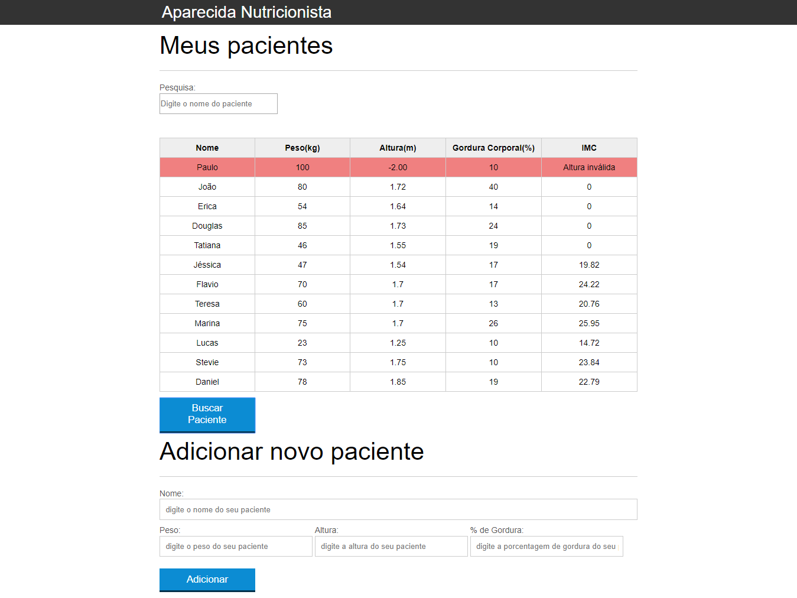

# estudos-javascript-alura
Estudos do curso JavaScript: Programando na linguagem Web


# Instalando

 1) Fazer o git clone do projeto.
 2) Para subir o servidor pode subir utilizando o http-server ou browser-sync:
     a) Instalar o npm
        ```
         npm install
        ```
     b) Rodar o  npm i -g http-server dentro da pasta www
        ```
         npm i -g http-server
        ```
     c) Ou 
        ```
        npm i -g browser-sync
        ```
     d) Para subir o server acessar a pasta o projto e rodar o comando: 
         ```
        browser-sync start --server --directory
         ```
 3) Acessar o endereço: http://localhost:3000/index.html


# Imagens Projeto Final
  
  